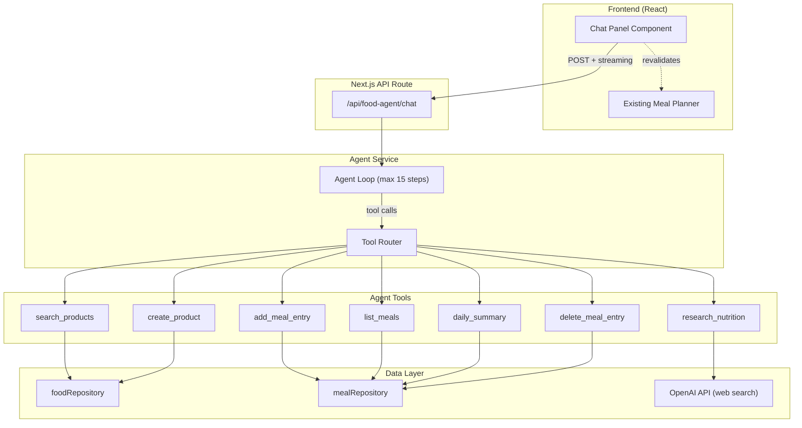

# Food Agent — Design Document

## Overview

Integrate an AI-powered food tracking agent into the existing fit-manager app. The agent provides a chat-style interface where users can describe what they ate in natural language (including Polish), and the agent autonomously searches the product database, researches nutrition data online, creates products, and records meal entries — asking for clarification (e.g., gram amounts) when needed.

The agent lives alongside the existing manual UI — the meal planner, product management, and all current workflows remain fully functional. The chat is an additive, faster interaction layer on top of the same data.

### Key behaviors

- Parse natural language food descriptions (Polish or English)
- Break composite meals into individual products
- Always ask for gram/portion amounts if not provided
- Check local product database first, research online only if needed
- Create products and meal entries through existing data layer
- Show brief summaries after recording meals
- Support queries like daily summary, listing meals, etc.

---

## Architecture



### Request flow

1. User types a message in the chat panel
2. Client POSTs to `/api/food-agent/chat` with the message and conversation history
3. Server authenticates the user, runs the agent loop
4. Agent calls OpenAI Responses API with tool definitions
5. For each tool call, the agent executes the corresponding handler against the real database
6. Loop continues until the model produces a text response (no more tool calls)
7. Response streams back to the client
8. Client appends the response and triggers a `router.refresh()` to update the meal planner

### API provider

Use OpenAI Responses API — consistent with the existing `ai-nutrition.ts` service. The app already has `OPENAI_API_KEY` configured. Model: `gpt-4.1` for the main agent, `gpt-4.1-mini` for nutrition research sub-calls.

---

## Components and Interfaces

### 1. API Route — `/api/food-agent/chat`

```typescript
// POST /api/food-agent/chat
// Request body:
{
  message: string;              // user's latest message
  history: ConversationMessage[]; // previous turns
}

// Streamed response: text/event-stream
// Each SSE event is either:
//   { type: "tool_call", name: string, args: object }       — show tool execution in UI
//   { type: "tool_result", name: string, success: boolean }  — tool completed
//   { type: "text", content: string }                        — agent response chunk
//   { type: "done", history: ConversationMessage[] }         — final event with updated history
```

Authentication: Uses `requireUserId()` from the existing auth layer.

### 2. Agent Service — `src/modules/food-agent/service.ts`

Core agent loop, adapted from the food_agent prototype:

```typescript
export async function runFoodAgent(params: {
  message: string;
  history: ConversationMessage[];
  userId: string;
  onToolCall?: (name: string, args: unknown) => void;
  onToolResult?: (name: string, success: boolean) => void;
}): Promise<{ response: string; history: ConversationMessage[] }>;
```

- Max 15 steps per invocation (same as prototype)
- Injects today's date into the system prompt
- Passes user ID to all tool handlers for data scoping

### 3. Tool Definitions — `src/modules/food-agent/tools.ts`

Seven tools exposed to the LLM:

| Tool                 | Description                                           | Maps to                                                                          |
| -------------------- | ----------------------------------------------------- | -------------------------------------------------------------------------------- |
| `search_products`    | Search user's product database by name                | `foodRepository.searchByName()`                                                  |
| `research_nutrition` | Web search for nutritional data per 100g              | OpenAI with `web_search_preview` (reuse existing pattern from `ai-nutrition.ts`) |
| `create_product`     | Save a new food product with macros per 100g          | `foodRepository.create()` + background categorization/photo                      |
| `add_meal_entry`     | Record a meal entry (date, meal type, product, grams) | `mealRepository.create()` + macro computation + daily log sync                   |
| `list_meals`         | Get meals for a specific date                         | `mealRepository.getEntriesByDate()`                                              |
| `daily_summary`      | Get aggregated macros for a date                      | `mealRepository.getDailyMacroSummary()`                                          |
| `delete_meal_entry`  | Remove a meal entry by ID                             | `mealRepository.delete()`                                                        |

#### Tool parameter schemas

```typescript
// search_products
{ search: string, limit?: number }

// research_nutrition
{ query: string }  // e.g., "raw chicken breast"

// create_product
{
  name: string,
  kcalPer100g: number,
  proteinPer100g: number,
  carbsPer100g: number,
  fatPer100g: number,
  fiberPer100g?: number,
  brand?: string,
  defaultServingG?: number,
  portionLabel?: string
}

// add_meal_entry
{
  date?: string,        // YYYY-MM-DD, defaults to today
  mealType: "breakfast" | "lunch" | "dinner" | "snack",
  productName: string,  // agent uses this to find the product ID
  amountG: number
}

// list_meals
{ date?: string }  // defaults to today

// daily_summary
{ date?: string }  // defaults to today

// delete_meal_entry
{ entryId: string }
```

#### Key implementation detail: `add_meal_entry`

The `add_meal_entry` handler does a product lookup by name (since the agent refers to products by name, not UUID), computes macros server-side using the same `computeMacros()` function from the existing meal actions, creates the entry, and syncs the daily log. This mirrors the existing `addMealEntry` server action flow.

### 4. System Prompt — `src/modules/food-agent/prompt.ts`

Adapted from the food_agent prototype's config, with adjustments for the integrated environment:

```
You are a food tracking assistant. You help users log meals by managing products
(nutritional definitions per 100g) and meal entries (actual eating events).

## TOOLS
[tool descriptions]

## WORKFLOW
1. ALWAYS ask for gram amounts if not provided
2. Break composite meals into individual products
3. Check database first (search_products)
4. If not found, research online (research_nutrition)
5. Save new products (create_product)
6. Record meal entries (add_meal_entry) — one per product per meal type
7. Show a brief summary after recording

## PRODUCT vs MEAL ENTRY
- Product = reusable food definition per 100g (created once, used many times)
- Meal entry = eating event on a specific date (references a product + gram amount)

## IMPORTANT
- Today's date: {today}
- Default meal type if unclear: "snack"
- Use ISO dates: YYYY-MM-DD
- Be concise. After adding entries, show totals.
- Do not lecture about nutrition unless asked.
- Respond in the same language the user uses.
```

### 5. Chat UI — `src/modules/food-agent/ui/food-agent-chat.tsx`

A collapsible chat panel that appears on the `/food` page:

**Collapsed state:** A floating action button (FAB) or a compact bar at the bottom of the page with a text input and send button. Keeps the meal planner fully visible.

**Expanded state:** A chat panel (bottom sheet on mobile, side panel on desktop) showing:

- Scrollable message history (user messages + agent responses)
- Tool execution indicators (e.g., "Searching products...", "Researching nutrition...")
- Text input with send button
- Clear conversation button

**State management:**

- Conversation history stored in React state (lost on page refresh — intentional, keeps it simple)
- `useTransition` for pending states during agent calls
- After agent completes an action that mutates data (add_meal_entry, create_product, delete_meal_entry), call `router.refresh()` to revalidate the meal planner

**UI components used:** Existing Radix/shadcn primitives (Sheet for side panel, Input, Button, ScrollArea).

### 6. Integration with existing `/food` page

The chat component is added to the food page layout as a client component:

```tsx
// In food/page.tsx — add alongside existing MealPlanner
<Suspense fallback={<Skeleton />}>
  <MealPlannerLoader />
</Suspense>
<FoodAgentChat />  {/* client component, renders the FAB + chat panel */}
```

No changes to the existing meal planner, product management, or settings pages. The agent creates the same database records as the manual UI — full interoperability.

---

## Data Models

No new database tables are required. The agent operates on the existing schema:

- **foodProduct** — Products created by the agent use `source: "ai_estimate"` (same as the current AI estimation flow)
- **mealEntry** — Entries created by the agent are identical to manually created ones
- **dailyLog** — Synced automatically after meal entry mutations (existing pattern)

### Conversation history

Conversation history is managed client-side in React state. It follows the OpenAI Responses API message format:

```typescript
type ConversationMessage =
  | { role: "user"; content: string }
  | { role: "assistant"; content: string }
  | { role: "system"; content: string };
```

Tool call/result messages are included in the full history passed to the API but are not rendered verbatim in the chat UI — only the final assistant text responses are shown, with tool execution shown as status indicators.

---

## Error Handling

| Scenario                         | Handling                                                        |
| -------------------------------- | --------------------------------------------------------------- |
| OpenAI API failure               | Return error message to chat; user can retry                    |
| Tool execution failure           | Return error as tool result; agent can try alternative approach |
| Product not found for meal entry | Agent receives error, can search/create the product             |
| Max steps reached (15)           | Return a message explaining the agent hit its step limit        |
| Auth failure                     | API route returns 401; client redirects to login                |
| Network error (client)           | Show error toast; preserve conversation state for retry         |
| Research returns no data         | Agent falls back to asking user for manual macro input          |
| Duplicate product name           | Agent receives error, adjusts name or updates existing          |

The agent loop wraps each tool call in try/catch and returns structured error responses, allowing the LLM to adapt its strategy (same pattern as the prototype).

---

## Testing Strategy

### Unit tests

- Tool handlers: verify each tool correctly calls the repository and returns expected output format
- System prompt generation: verify date injection and structure
- Macro computation: reuse existing tests for `computeMacros()`

### Integration tests

- Full agent loop with mocked OpenAI responses: verify tool call → handler → result → next step flow
- API route: verify auth, request parsing, and streaming response format

### Manual / E2E testing

- Chat UI interaction: send messages, verify tool status indicators, verify meal planner updates
- Polish language input: "Zjadlem 200g piersi z kurczaka na obiad"
- Composite meal: "Na lunch jadlem kurczaka z ryzem i brokuly"
- Missing gram amount: verify agent asks for clarification
- Product reuse: add a product, then reference it again in a new meal
- Daily summary query: "Co dzis jadlem?" / "Ile kalorii dzis?"

---

## File Structure

```
src/modules/food-agent/
  service.ts          — Agent loop (runFoodAgent)
  tools.ts            — Tool definitions + handlers
  prompt.ts           — System prompt template
  types.ts            — Shared types (ConversationMessage, etc.)
  ui/
    food-agent-chat.tsx — Main chat panel component
    chat-message.tsx    — Individual message rendering
    tool-status.tsx     — Tool execution indicator

src/app/api/food-agent/
  chat/route.ts       — POST handler with streaming
```

---

## Implementation Plan

### Task 1: Types and system prompt

Create the shared types and system prompt template.

Files to create:
- `src/modules/food-agent/types.ts` — `ConversationMessage`, `ToolCallEvent`, `AgentResponse` types
- `src/modules/food-agent/prompt.ts` — System prompt template with `{today}` placeholder, adapted from prototype's config.js instructions

Acceptance:
- [ ] Types compile with no errors
- [ ] `buildSystemPrompt()` returns prompt with today's date injected

### Task 2: Tool definitions and handlers

Create the 7 tool definitions (OpenAI function tool format) and their server-side handlers.

Files to create:
- `src/modules/food-agent/tools.ts`

Each handler:
- `search_products(userId, { search, limit? })` → calls `foodRepository.searchByName()`, returns `{ count, products[] }` with name + macros per 100g
- `research_nutrition(userId, { query })` → runs a sub-agent call to OpenAI with `web_search_preview` + `save_product` tool (reuse the pattern from `ai-nutrition.ts:runNutritionAgent`), returns `{ name, kcalPer100g, proteinPer100g, carbsPer100g, fatPer100g, fiberPer100g, portionG?, portionLabel? }`
- `create_product(userId, { name, kcalPer100g, proteinPer100g, carbsPer100g, fatPer100g, fiberPer100g?, brand?, defaultServingG?, portionLabel? })` → calls `foodRepository.create()` with `source: "ai_estimate"`, fires background categorization + photo generation, returns created product
- `add_meal_entry(userId, { date?, mealType, productName, amountG })` → looks up product by name via `foodRepository.searchByName()`, takes first exact/best match, computes macros with `computeMacros()`, calls `mealRepository.create()`, syncs daily log, returns entry summary with macros
- `list_meals(userId, { date? })` → calls `mealRepository.getEntriesByDate()`, formats as grouped-by-mealType list
- `daily_summary(userId, { date? })` → calls `mealRepository.getDailyMacroSummary()` + `mealRepository.getEntriesByDate()` for breakdown
- `delete_meal_entry(userId, { entryId })` → calls `mealRepository.delete()`, syncs daily log

Acceptance:
- [ ] All 7 tool definitions match OpenAI function tool JSON schema
- [ ] Each handler calls correct repository method with user scoping
- [ ] `add_meal_entry` correctly computes macros and syncs daily log
- [ ] `research_nutrition` returns structured macro data from web search

### Task 3: Agent loop service

Create the core agent loop that orchestrates LLM calls and tool execution.

Files to create:
- `src/modules/food-agent/service.ts`

Implementation:
- `runFoodAgent({ message, history, userId, onToolCall?, onToolResult? })` function
- Uses OpenAI Responses API (`client.responses.create()`) with tool definitions from Task 2
- Loop: send messages → check for tool calls → execute handlers → feed results back → repeat
- Max 15 steps, then return error message
- `onToolCall` / `onToolResult` callbacks for streaming UI updates
- Returns `{ response: string, history: ConversationMessage[] }`
- Uses `gpt-4.1` model with medium reasoning effort

Acceptance:
- [ ] Agent loop correctly chains tool calls until text response
- [ ] Conversation history is properly accumulated and returned
- [ ] Step limit is enforced
- [ ] Callbacks fire for each tool call/result

### Task 4: API route

Create the streaming HTTP endpoint.

Files to create:
- `src/app/api/food-agent/chat/route.ts`

Implementation:
- POST handler that accepts `{ message: string, history: ConversationMessage[] }`
- Authenticates via `requireUserId()`
- Creates a `ReadableStream` that:
  - Calls `runFoodAgent()` with callbacks that write SSE events for tool calls/results
  - Writes final text response and updated history as SSE events
- Returns `Response` with `text/event-stream` content type

SSE event format:
```
data: {"type":"tool_call","name":"search_products","args":{...}}
data: {"type":"tool_result","name":"search_products","success":true}
data: {"type":"text","content":"...agent response..."}
data: {"type":"done","history":[...]}
```

Acceptance:
- [ ] Route returns 401 for unauthenticated requests
- [ ] SSE stream includes tool_call, tool_result, text, and done events
- [ ] History is returned in the done event for client persistence

### Task 5: Chat UI components

Build the chat interface.

Files to create:
- `src/modules/food-agent/ui/food-agent-chat.tsx` — Main chat panel (client component)
- `src/modules/food-agent/ui/chat-message.tsx` — Message bubble rendering
- `src/modules/food-agent/ui/tool-status.tsx` — Tool execution indicator

`food-agent-chat.tsx`:
- Floating button at bottom-right that opens a Sheet (side panel on desktop, bottom sheet on mobile)
- Inside: ScrollArea with messages, input bar at bottom
- State: `messages[]`, `isLoading`, `history[]` (for API)
- On send: POST to `/api/food-agent/chat`, consume SSE stream, append messages
- After mutations (detected via `done` event): call `router.refresh()`
- Clear conversation button in header

`chat-message.tsx`:
- User messages: right-aligned, styled bubble
- Agent messages: left-aligned, rendered as markdown (for formatting tables, lists)
- Use existing shadcn components

`tool-status.tsx`:
- Shows tool name with a spinner while executing
- Shows checkmark or X on completion
- Compact inline display within the message flow

File to modify:
- `src/app/(protected)/food/page.tsx` — Add `<FoodAgentChat />` client component

Acceptance:
- [ ] Chat opens/closes via floating button
- [ ] Messages stream in as SSE events arrive
- [ ] Tool execution shown as status indicators
- [ ] Meal planner refreshes after agent creates/deletes entries
- [ ] Works on mobile (bottom sheet) and desktop (side panel)
- [ ] Input supports Enter to send, Shift+Enter for newline
