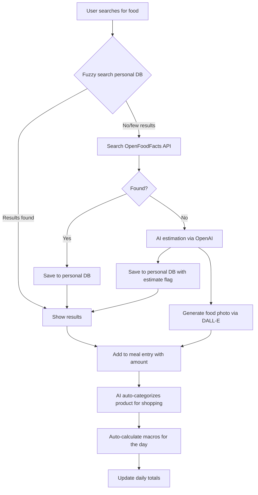

# Food Tracking Feature — Design Document

## Overview

Add comprehensive food tracking to Fit Manager: a personal food database with macro/calorie data, multi-day meal planning with a 3-day visible planner, and shopping list generation from planned meals.

The feature integrates with OpenFoodFacts API (strong Polish product coverage) as primary nutrition data source, with OpenAI-powered estimation as fallback for unknown products. AI is also used to generate food photos and auto-categorize ingredients into shopping groups. Every product looked up or manually entered gets saved to the user's personal database for instant reuse.

### Goals

- Track daily food intake broken down by meal type with full macro data (kcal, protein, carbs, fat, fiber)
- Build a personal food product database that grows with usage
- Fuzzy search products across personal DB and OpenFoodFacts API
- AI fallback (OpenAI) for macro estimation of unknown products
- AI-generated food photos for meal entries
- AI-powered auto-categorization of ingredients into shopping groups
- Multi-day meal planner with 3 days visible simultaneously
- User-configurable shopping categories with custom ordering
- Generate categorized shopping lists from planned meal date ranges
- Extend existing `dailyLog` calorie tracking to be computed from meal entries
- Add macro goals (protein, carbs, fat, fiber) alongside existing caloric goal

### Non-Goals (for now)

- Barcode scanning
- Recipe builder with step-by-step instructions
- Sharing meals with other users
- Micronutrient tracking (vitamins, minerals)
- Restaurant menu integration

---

## Architecture

### High-Level Flow



### Module Structure

Following the existing pattern (`modules/{feature}/actions.ts`, `repositories/`, `schemas.ts`, `ui/`):

```
src/modules/food/
├── actions.ts                    # Server actions for food CRUD + search
├── schemas.ts                    # Zod validation schemas
├── repositories/
│   └── food.repo.ts              # Food product DB queries (with fuzzy search)
├── services/
│   ├── openfoodfacts.ts          # OpenFoodFacts API client
│   └── ai-nutrition.ts           # OpenAI-powered macro estimation + photo gen + categorization
└── ui/
    ├── food-search.tsx           # Fuzzy search + add food component
    ├── food-product-form.tsx     # Manual food entry/edit form
    └── food-product-list.tsx     # Personal food database browser

src/modules/meal/
├── actions.ts                    # Server actions for meal planning
├── schemas.ts                    # Zod schemas for meals
├── repositories/
│   └── meal.repo.ts              # Meal + entry queries
└── ui/
    ├── meal-planner.tsx          # 3-day planner view (main layout)
    ├── day-column.tsx            # Single day column with meal sections
    ├── meal-section.tsx          # Single meal type (breakfast/lunch/etc)
    ├── meal-entry-card.tsx       # Food card with photo, name, kcal
    └── macro-summary.tsx         # Daily/meal macro totals + goals

src/modules/shopping/
├── actions.ts                    # Shopping list generation
├── schemas.ts                    # Zod schemas
├── repositories/
│   └── shopping.repo.ts          # Shopping category queries
└── ui/
    ├── shopping-list-generator.tsx  # Date range picker + generate button
    ├── shopping-list-view.tsx       # Categorized list display
    ├── shopping-category.tsx        # Single category section
    └── category-manager.tsx         # User's category config (CRUD + reorder)

src/app/(protected)/food/
├── page.tsx                      # 3-day meal planner (main page)
├── products/
│   └── page.tsx                  # Personal food database management
└── settings/
    └── page.tsx                  # Shopping categories config + macro goals
```

### Navigation

Add "Food" to the sidebar nav between "Training" and "Body":

```ts
{ label: "Food", icon: UtensilsIcon, href: "/food" }
```

---

## Components and Interfaces

### Food Search — Fuzzy Search

The search uses PostgreSQL `pg_trgm` extension for fuzzy/similarity matching against the personal food database, combined with `ILIKE` for partial matches:

```sql
-- Enable trigram extension (one-time migration)
CREATE EXTENSION IF NOT EXISTS pg_trgm;

-- Create GIN index for fast fuzzy search
CREATE INDEX food_product_name_trgm_idx ON food_product USING GIN (name gin_trgm_ops);
```

Search strategy (all in one debounced action, 300ms):

```
1. Fuzzy search personal DB using trigram similarity (threshold 0.3)
   - ORDER BY similarity(name, query) DESC
   - Also matches via ILIKE '%query%' for substring hits
2. In parallel: query OpenFoodFacts API with the same search term
3. Merge results: personal DB first, then API results (deduplicated by source_id)
4. "Not found?" button → opens AI estimation modal
```

This means typing "jogrt" will still match "Jogurt naturalny", and "snick" will match "Snickers".

### 3-Day Meal Planner Layout (`/food`)

Inspired by the Fitatu screenshot — the main view shows 3 consecutive days side by side:

```
┌─────────────────────────────────────────────────────────┐
│  ← prev    Mon 24/03        Tue 25/03       Wed 26/03  →  next │
│            2044 kcal        2178 kcal       2261 kcal          │
├──────────────────┬──────────────────┬───────────────────┤
│  Breakfast       │  Breakfast       │  Breakfast        │
│ ┌──────┐┌──────┐ │ ┌──────┐┌──────┐ │ ┌──────┐  [+]   │
│ │ 🖼️   ││ 🖼️   │ │ │ 🖼️   ││ 🖼️   │ │ │ 🖼️   │        │
│ │330cal││539cal│ │ │600cal││330cal│ │ │539cal│        │
│ │Omlet ││Plack.│ │ │Salat.││Omlet │ │ │Plack.│        │
│ └──────┘└──────┘ │ └──────┘└──────┘ │ └──────┘        │
│                  │                  │                  │
│  Lunch           │  Lunch           │  Lunch           │
│ ┌──────┐┌──────┐ │ ┌──────┐  [+]   │ ┌──────┐┌──────┐ │
│ │ 🖼️   ││ 🖼️   │ │ │ 🖼️   │        │ │ 🖼️   ││ 🖼️   │ │
│ │600cal││636cal│ │ │636cal│        │ │600cal││636cal│ │
│ │Sałat.││Owsia.│ │ │Owsia.│        │ │Sałat.││Owsia.│ │
│ └──────┘└──────┘ │ └──────┘        │ └──────┘└──────┘ │
│  ...             │  ...             │  ...              │
└──────────────────┴──────────────────┴───────────────────┘
```

- Desktop: 3 columns side by side, scrollable vertically per meal type
- Mobile: horizontally swipeable, 1 day visible at a time (with peek of adjacent days)
- Each day column shows: date, day name, total kcal, and meal sections
- Each meal entry is a card with: food photo (AI-generated or placeholder), kcal, truncated name
- Each entry supports optional notes (e.g., YouTube recipe link, cooking tips) — shown as a small icon on the card, expandable on click
- [+] button per meal section to add entries via the food search modal
- Day header shows macro progress bar (compact) with kcal prominently displayed

### Food Photos (AI-Generated)

When a new food product is created (from any source), we generate a photo using OpenAI's DALL-E:

```ts
// Photo generation prompt
const prompt = `Appetizing overhead photo of ${productName}, food photography style,
clean white plate, natural lighting, minimal styling. Square format.`
```

- Generate a small image (256x256 or 512x512) to keep costs low
- Store in S3 (reusing existing S3 integration)
- Photo generation is async — show placeholder while generating, update when ready
- Cache on `food_product.image_url` — generate once per product
- User can also upload their own photo to override

### AI Auto-Categorization for Shopping

When a product is added (from OpenFoodFacts or manually), OpenAI assigns it to one of the user's shopping categories:

```ts
const prompt = `Given these shopping categories: ${userCategories.map(c => c.name).join(", ")}
Categorize this food product: "${productName}" (brand: "${brand}")
Return the category name that best fits.`
```

- Runs automatically on product creation
- User can override the category manually
- If OpenFoodFacts provides `categories_tags`, we use those as hints in the prompt for better accuracy

### User-Configurable Shopping Categories

Instead of hardcoded categories, each user manages their own list:

- CRUD for categories (name + icon/emoji optional)
- Drag-and-drop reordering (reusing existing `@dnd-kit` setup)
- Default set created on first use (sensible Polish supermarket order)
- Accessible via `/food/settings` or a settings section
- Shopping list generation uses the user's category order

### Meal Templates (Reusable Meals)

Users can save a combination of food entries as a "meal template" (e.g., "My standard breakfast") for quick reuse. This is a named collection of food products with default amounts.

### Shopping List Generator

- User selects specific days (multi-select checkboxes on the planner, or a date range picker)
- Server action aggregates all `meal_entry` items across selected days
- Groups by food product, sums amounts (in grams)
- Categorizes into the user's shopping categories based on each product's `category_id`
- Displays grouped list in the user's custom category order, with checkboxes for checking items off
- Option to copy as text (for sharing/pasting into notes)

### Macro Goals

Extend the user profile with macro targets:

- Protein goal (g)
- Carbs goal (g)
- Fat goal (g)
- Fiber goal (g)

These are displayed as progress bars on the daily food view alongside the existing caloric goal. Configurable via `/food/settings` or the existing caloric goal dialog (extended).

---

## Data Models

### New Tables

```sql
-- User-configurable shopping categories
shopping_category
  id              UUID PK
  user_id         TEXT FK → user.id (CASCADE)
  name            TEXT NOT NULL
  position        INTEGER NOT NULL      -- user-defined ordering
  created_at      TIMESTAMP
  updated_at      TIMESTAMP
  INDEX (user_id, position)

-- Food product database (personal cache + manual entries)
food_product
  id              UUID PK
  user_id         TEXT FK → user.id (CASCADE)
  name            TEXT NOT NULL
  brand           TEXT
  category_id     UUID FK → shopping_category.id (SET NULL)  -- user's shopping category
  source          TEXT NOT NULL          -- "openfoodfacts" | "ai_estimate" | "manual"
  source_id       TEXT                   -- OpenFoodFacts barcode/ID for dedup
  image_url       TEXT                   -- AI-generated or user-uploaded photo (S3)
  is_verified     BOOLEAN DEFAULT false  -- user confirmed the macros are correct
  -- Macros per 100g
  kcal_per_100g   NUMERIC(7,2) NOT NULL
  protein_per_100g NUMERIC(7,2) NOT NULL
  carbs_per_100g  NUMERIC(7,2) NOT NULL
  fat_per_100g    NUMERIC(7,2) NOT NULL
  fiber_per_100g  NUMERIC(7,2)
  -- Default serving
  default_serving_g INTEGER DEFAULT 100
  created_at      TIMESTAMP
  updated_at      TIMESTAMP
  INDEX (user_id, name)  -- also GIN trigram index for fuzzy search
  UNIQUE (user_id, source, source_id)  -- prevent duplicate imports

-- Meal type enum
meal_type_enum: "breakfast" | "lunch" | "dinner" | "snack"

-- Daily meal entries
meal_entry
  id              UUID PK
  user_id         TEXT FK → user.id (CASCADE)
  date            DATE NOT NULL
  meal_type       meal_type_enum NOT NULL
  food_product_id UUID FK → food_product.id (CASCADE)
  amount_g        NUMERIC(7,1) NOT NULL  -- actual amount consumed
  notes           TEXT                    -- optional notes (e.g., recipe link, cooking tips)
  -- Cached calculated macros (computed on save for query performance)
  kcal            NUMERIC(7,1)
  protein         NUMERIC(7,2)
  carbs           NUMERIC(7,2)
  fat             NUMERIC(7,2)
  fiber           NUMERIC(7,2)
  position        INTEGER NOT NULL DEFAULT 0  -- ordering within meal
  created_at      TIMESTAMP
  updated_at      TIMESTAMP
  INDEX (user_id, date)
  INDEX (user_id, date, meal_type)

-- Reusable meal templates
meal_template
  id              UUID PK
  user_id         TEXT FK → user.id (CASCADE)
  name            TEXT NOT NULL
  meal_type       meal_type_enum  -- suggested meal type (nullable)
  created_at      TIMESTAMP
  updated_at      TIMESTAMP
  INDEX (user_id)

-- Items within a meal template
meal_template_item
  id              UUID PK
  template_id     UUID FK → meal_template.id (CASCADE)
  food_product_id UUID FK → food_product.id (CASCADE)
  amount_g        NUMERIC(7,1) NOT NULL
  position        INTEGER NOT NULL DEFAULT 0
  created_at      TIMESTAMP
  updated_at      TIMESTAMP
```

### Modified Tables

```sql
-- user table: add macro goals
ALTER user ADD COLUMN protein_goal INTEGER;    -- daily grams
ALTER user ADD COLUMN carbs_goal INTEGER;      -- daily grams
ALTER user ADD COLUMN fat_goal INTEGER;        -- daily grams
ALTER user ADD COLUMN fiber_goal INTEGER;      -- daily grams
```

### Default Shopping Categories

Seeded on first use, user can customize after:

```ts
export const DEFAULT_SHOPPING_CATEGORIES = [
  { name: "Bread & Bakery",           position: 0 },
  { name: "Fruits",                   position: 1 },
  { name: "Vegetables",               position: 2 },
  { name: "Dairy & Eggs",             position: 3 },
  { name: "Meat & Fish",              position: 4 },
  { name: "Deli & Cold Cuts",         position: 5 },
  { name: "Pasta, Rice & Grains",     position: 6 },
  { name: "Canned & Jarred",          position: 7 },
  { name: "Frozen",                   position: 8 },
  { name: "Snacks & Sweets",          position: 9 },
  { name: "Beverages",                position: 10 },
  { name: "Oils, Sauces & Condiments",position: 11 },
  { name: "Spices & Seasonings",      position: 12 },
  { name: "Other",                    position: 13 },
] as const;
```

### Data Flow: Daily Calories Integration

The existing `dailyLog.kcal` field currently stores a manually entered value. With food tracking:

- `dailyLog.kcal` becomes the **computed sum** of all `meal_entry.kcal` for that day
- OR remains manually overridable (user can still type a number directly if they don't want to log individual foods)
- A server action `syncDailyLogFromMeals` recalculates and updates `dailyLog.kcal` whenever meal entries change

---

## External Integrations

### OpenFoodFacts API

- **Endpoint:** `https://world.openfoodfacts.org/cgi/search.pl`
- **Search:** `?search_terms={query}&search_simple=1&action=process&json=1&page_size=10&cc=pl&lc=pl`
- **Product:** `https://world.openfoodfacts.org/api/v2/product/{barcode}.json`
- **Rate limit:** ~10 req/sec (no auth needed)
- **Data mapping:**
  - `product.product_name` → name
  - `product.brands` → brand
  - `product.nutriments.energy-kcal_100g` → kcal_per_100g
  - `product.nutriments.proteins_100g` → protein_per_100g
  - `product.nutriments.carbohydrates_100g` → carbs_per_100g
  - `product.nutriments.fat_100g` → fat_per_100g
  - `product.nutriments.fiber_100g` → fiber_per_100g
  - `product.categories_tags` → used as hint for AI category assignment
  - `product.image_url` → image_url (if available, skip DALL-E generation)

### OpenAI Integration

Three AI capabilities via OpenAI API:

#### 1. Macro Estimation (GPT-4o-mini)

When a product isn't found via OpenFoodFacts:

```ts
const prompt = `Estimate nutritional values per 100g for: "${productName}".
Return JSON: { kcal, protein, carbs, fat, fiber }
Use reliable nutritional databases as reference. If this is a branded product, use known label data.
Be as accurate as possible.`
```

- Products from AI get `source: "ai_estimate"` and `is_verified: false`
- UI shows a subtle indicator (e.g., "~" prefix or info icon) for estimated values
- User can edit and verify, which sets `is_verified: true`
- Model: `gpt-4o-mini` (cheap, fast, sufficient for structured data extraction)

#### 2. Food Photo Generation (DALL-E 3)

```ts
const prompt = `Appetizing overhead food photo of ${productName},
food photography, clean white background, natural lighting, minimal. Square.`
```

- Size: 1024x1024 (DALL-E 3 minimum), downscaled to 256x256 before S3 upload
- Cost: ~$0.04 per image (DALL-E 3 standard)
- Generated async after product creation, placeholder shown immediately
- Skipped if OpenFoodFacts already provides an image
- Stored in S3 at `food-photos/{userId}/{productId}.webp`

#### 3. Shopping Category Assignment (GPT-4o-mini)

```ts
const prompt = `Given these shopping categories: [${categories}]
Which category does "${productName}" (brand: "${brand}") belong to?
Return only the category name, nothing else.`
```

- Runs on product creation, result saved to `food_product.category_id`
- User can always override manually
- Uses OpenFoodFacts `categories_tags` as additional context when available

### Environment Variables

```
OPENAI_API_KEY=sk-...
```

Added to `src/env.js` validation schema.

---

## Error Handling

| Scenario | Handling |
|---|---|
| OpenFoodFacts API down/timeout | Show personal DB results only, log error, no user-facing error |
| OpenAI estimation fails | Show manual entry form as fallback |
| DALL-E photo generation fails | Use placeholder image, log error, don't block product creation |
| AI categorization fails | Assign "Other" category, user can fix manually |
| Product has incomplete macros from API | Import what's available, flag missing fields for user to fill |
| Duplicate product import | Upsert on `(user_id, source, source_id)` unique constraint |
| Invalid amount entered | Zod validation, minimum 0.1g |
| Shopping list for days with no meals | Show empty state with helpful message |
| Network error during search | Debounced retry, graceful degradation to local DB search |
| pg_trgm extension not available | Fall back to ILIKE search only |

Server actions follow existing pattern: `{ ok: boolean, data?: T, error?: string }`.

---

## Testing Strategy

### Unit Tests

- Macro calculation functions (amount × per_100g / 100)
- Shopping list aggregation and categorization logic
- OpenFoodFacts response parsing and data mapping
- Fuzzy search query building and result merging
- Zod schema validation for all forms

### Integration Tests

- Food search flow: fuzzy local DB → API → AI fallback chain
- Meal entry CRUD with macro recalculation
- Shopping list generation across date ranges with custom category ordering
- Daily log sync from meal entries
- Meal template apply flow
- Shopping category CRUD and reordering

### Manual Testing

- Search for Polish products (Żywiec Zdrój, Kabanosy, Ptasie Mleczko)
- Fuzzy search: type "jogrt" → expect "Jogurt naturalny" match
- Add custom product → verify AI photo generation and categorization
- Plan 3 days of meals → verify multi-day planner layout
- Generate shopping list for a week → verify custom category ordering
- Reorder shopping categories → verify list updates
- Test 3-day layout on desktop (3 columns) and mobile (swipeable)

---

## Key Design Decisions

1. **Macros stored per 100g, not per serving** — This is the standard in Europe (and what OpenFoodFacts provides). Serving sizes vary, but per-100g is universal and makes math simple.

2. **Cached macros on meal_entry** — We denormalize calculated macros onto each entry rather than computing on read. This avoids JOIN-heavy queries for daily summaries and makes the shopping list aggregation faster. Trade-off: need to recalculate if the product's macros are updated (rare).

3. **Personal DB per user, not shared** — Each user has their own food product database. Simpler permissions, no moderation needed, and users can customize product data (e.g., their specific brand of bread). Trade-off: no benefit from other users' additions, but this is a personal app.

4. **OpenFoodFacts over USDA** — USDA has better data quality but is US-focused. OpenFoodFacts has vastly better coverage for Polish products. We can add USDA as a secondary source later if needed.

5. **User-owned shopping categories** — Categories and their order are fully user-configurable (stored in DB, not hardcoded). Default set seeded on first use. Users know their own shop layout best.

6. **Meal templates are separate from meal entries** — Templates are blueprints, entries are instances. Editing a template doesn't retroactively change past entries. This prevents data integrity issues.

7. **dailyLog.kcal becomes dual-mode** — Can be auto-computed from meal entries OR manually entered. This preserves backwards compatibility with existing data and gives flexibility for days when detailed tracking isn't wanted.

8. **PostgreSQL pg_trgm for fuzzy search** — No need for external search engines at personal-app scale. Trigram similarity matching handles typos and partial names well, with GIN index for performance.

9. **OpenAI as AI provider** — Used for three purposes: macro estimation (GPT-4o-mini), photo generation (DALL-E 3), and shopping category assignment (GPT-4o-mini). All are fire-and-forget or async, so they don't block the core UX.

10. **3-day planner layout** — Shows 3 consecutive days side by side (desktop) or as swipeable cards (mobile). This enables weekly meal planning at a glance without overwhelming the screen. Inspired by Fitatu's planner UX.

11. **AI photos are nice-to-have, not blocking** — Photo generation is async. Product creation succeeds immediately with a placeholder. The photo appears when ready. If DALL-E fails, the product still works fine.
