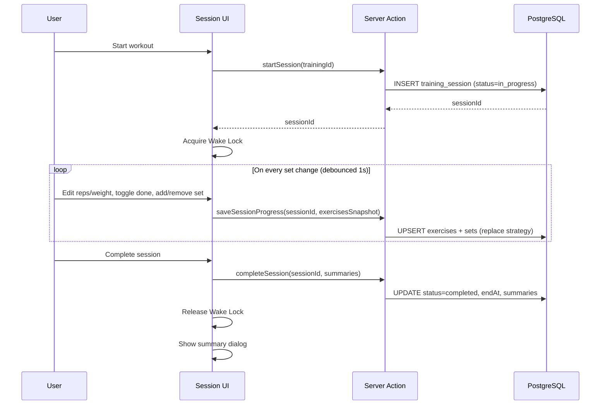

# Session Auto-Save & Recovery

## Overview

Training sessions currently live entirely in React state. If the browser tab gets suspended (common on mobile iOS/Android after ~30s of inactivity), the page reloads and all progress is lost. This feature introduces server-side session persistence so that in-progress workouts survive page reloads, tab suspensions, and app switches.

The design uses a two-layer approach:
1. **Wake Lock API** — prevents the screen from dimming/sleeping during an active session (reduces the chance of tab suspension)
2. **Database auto-save** — persists session state on every meaningful user action, enabling full recovery on reload

## Architecture

### Current Flow

```
[User starts workout] → React state initialized from template + last session
[User logs sets]      → React state updated (ephemeral)
[User hits Complete]  → Single atomic write to DB (session + exercises + sets)
[Page reload]         → All progress lost ❌
```

### New Flow

```
[User starts workout] → DB row created (status: in_progress) + Wake Lock acquired
[User logs sets]      → Debounced auto-save to DB after each change
[Page reload]         → Detect in-progress session → restore form state ✅
[User hits Complete]  → Finalize session (status: completed, compute summaries)
[User abandons]       → Session stays in_progress, can resume or discard later
```



## Components and Interfaces

### Schema Changes

Add a `status` column to `training_session`:

```typescript
// schema.ts — training_session table
export const sessionStatusEnum = pgEnum("session_status", [
  "in_progress",
  "completed",
]);

export const trainingSession = createTable("training_session", (d) => ({
  // ... existing columns ...
  status: sessionStatusEnum("status").notNull().default("completed"),
}));
```

Using `default("completed")` ensures backward compatibility — all existing sessions are implicitly completed.

### New Server Actions

```typescript
// session/actions.ts

// Called when user opens a session page
startStrengthSession(trainingId: string): Promise<{
  sessionId: string;
  startAt: string;
}>

// Called on debounced form changes
saveSessionProgress(input: {
  sessionId: string;
  exercises: Array<{
    templateExerciseId?: string | null;
    name: string;
    position: number;
    sets: Array<{
      setIndex: number;
      reps: number | null;
      weight: number | null;
      isDone: boolean;
    }>;
  }>;
}): Promise<void>

// Called when user hits "Complete session"
// Now updates existing session instead of inserting new one
completeStrengthSession(input: {
  sessionId: string;
  durationSec: number;
  totalLoadKg: number;
  progress: Array<{ position: number; name: string; prevVolume: number; currentVolume: number; delta: number; }>;
}): Promise<void>

// Called to check for resumable session when page loads
findInProgressSession(trainingId: string): Promise<InProgressSession | null>

// Called when user explicitly discards a session
discardSession(sessionId: string): Promise<void>
```

### New Repository Methods

```typescript
// session.repo.ts

// Create a new in_progress session row
createInProgressSession(userId: string, trainingId: string): Promise<{ id: string; startAt: Date }>

// Replace all exercises and sets for an in-progress session
// Uses delete + insert strategy within a transaction for simplicity
upsertSessionProgress(sessionId: string, exercises: ExerciseSnapshot[]): Promise<void>

// Finalize: set status=completed, endAt, duration, totalLoad
finalizeSession(sessionId: string, summary: SessionSummaryPayload): Promise<void>

// Find an in-progress session for a given training (user-scoped)
findInProgressSession(userId: string, trainingId: string): Promise<InProgressSessionWithDetails | null>

// Delete an in-progress session and its related rows (cascade handles children)
deleteSession(sessionId: string): Promise<void>
```

### Updated Types

```typescript
// session/types.ts

type InProgressSession = {
  sessionId: string;
  startAt: string;
  exercises: Array<{
    name: string;
    position: number;
    templateExerciseId: string | null;
    sets: Array<{
      setIndex: number;
      reps: number | null;
      weight: number | null;
      isDone: boolean;
    }>;
  }>;
};
```

### UI Changes: `StrengthSessionView`

The component currently receives `template` and `last` as props. The new flow adds:

1. **Page-level changes** (`training/session/[id]/page.tsx`):
   - On load, call `findInProgressSession(trainingId)`
   - If found → pass `inProgress` data to `StrengthSessionView` along with `template` and `last`
   - If not found → call `startStrengthSession(trainingId)` to create a new in-progress session
   - Pass `sessionId` as a prop to the view

2. **StrengthSessionView changes**:
   - Accept new prop: `sessionId: string` and optional `inProgress: InProgressSession`
   - If `inProgress` is provided, initialize form from its data instead of from `last`
   - Restore `sessionStartAtMs` from `inProgress.startAt` (so the timer continues correctly)
   - Show a dismissible banner: "Resuming session from {time}" when recovering
   - Add an auto-save hook that watches form state and debounces saves

3. **New hook: `useAutoSave`**:
   ```typescript
   function useAutoSave(sessionId: string, control: Control) {
     const exercises = useWatch({ control, name: "exercises" });
     // Debounce 1 second after last change
     // Call saveSessionProgress server action
     // Track save status for UI indicator
   }
   ```

4. **Save status indicator** in the sticky header:
   - Small text/icon showing "Saving..." / "Saved" / "Offline" next to the timer

5. **Wake Lock hook: `useWakeLock`**:
   ```typescript
   function useWakeLock() {
     // Request wake lock on mount
     // Re-acquire on visibilitychange (required by spec)
     // Release on unmount
     // Graceful fallback — no-op if unsupported
   }
   ```

6. **Discard session**: Add a menu option or button to abandon the current session (deletes the in-progress record and navigates back).

### Set `isDone` Persistence

The current `isDone` state (checkbox "Done") lives in a local `doneMap` React state and is not part of the form values or DB schema. To persist it:

- Add an `isDone` boolean column to `training_session_set` (default `false`)
- Include it in the auto-save payload
- Restore it from the in-progress session data on recovery

```typescript
// schema.ts — training_session_set
isDone: d.boolean("is_done").notNull().default(false),
```

## Data Models

### Database Migration

```sql
-- Add session status enum and column
CREATE TYPE session_status AS ENUM ('in_progress', 'completed');
ALTER TABLE "fit-manager_training_session"
  ADD COLUMN "status" session_status NOT NULL DEFAULT 'completed';

-- Add isDone to sets
ALTER TABLE "fit-manager_training_session_set"
  ADD COLUMN "is_done" boolean NOT NULL DEFAULT false;

-- Index for quick lookup of in-progress sessions
CREATE INDEX "training_session_user_training_status_idx"
  ON "fit-manager_training_session" ("user_id", "training_id", "status")
  WHERE "status" = 'in_progress';
```

### Auto-Save Payload Shape

The auto-save writes the full exercise+sets snapshot each time (replace strategy). This is simpler than diffing individual set changes and the payload is small (typically 4-8 exercises × 3-5 sets = 12-40 rows).

```typescript
// What gets sent on each debounced save
{
  sessionId: "uuid",
  exercises: [
    {
      templateExerciseId: "uuid" | null,
      name: "Bench Press",
      position: 0,
      sets: [
        { setIndex: 0, reps: 8, weight: 80, isDone: true },
        { setIndex: 1, reps: 8, weight: 80, isDone: false },
      ]
    }
  ]
}
```

### Save Strategy: Delete + Insert

Inside `upsertSessionProgress`, within a transaction:
1. Delete all `training_session_exercise` rows for this session (cascade deletes sets)
2. Re-insert all exercises and sets from the snapshot

This is simpler than tracking individual adds/removes/updates, and the row counts are small enough that performance is fine.

## Error Handling

| Scenario | Behavior |
|---|---|
| Auto-save fails (network error) | Show "Save failed" indicator. Retry on next change. Data stays in React state so nothing is lost immediately. |
| Page reloads with no network | Page can't load at all (SSR). No special offline handling needed — this is a server-rendered app. |
| Wake Lock not supported | Graceful no-op. Auto-save still protects against data loss. |
| Multiple tabs open same session | `findInProgressSession` returns the same session. Both tabs write to it. Last write wins. Acceptable for single-user app. |
| User starts session, never finishes | In-progress sessions remain in DB. On next visit to same training, prompt to resume or discard. |
| Stale in-progress sessions | Sessions older than 24 hours could be auto-discarded or shown with a warning. Not critical for v1 — the resume/discard prompt handles this. |
| `completeStrengthSession` called on already-completed session | Return error, UI handles gracefully. |

### Validation

- `saveSessionProgress` accepts partial data (reps/weight can be null for incomplete sets) — this is less strict than the completion schema which requires positive reps
- `completeStrengthSession` still validates with the existing strict schema before finalizing
- `sessionId` ownership is verified on every action (session.userId === current user)

## Testing Strategy

### Unit Tests
- Auto-save debounce hook: verify it batches rapid changes and fires after the debounce window
- Form restoration: given an `InProgressSession`, verify form initializes correctly with all values including `isDone` state
- Timer restoration: verify `sessionStartAtMs` is correctly set from `inProgress.startAt`

### Integration Tests
- Start session → save progress → reload page → verify form state is restored
- Start session → save progress → complete → verify final data matches
- Start session → discard → verify session and related rows are deleted
- Start session for training A → navigate to training A again → verify resume prompt appears

### Manual Testing (Mobile)
- Start session on iOS Safari → lock phone for 2 min → unlock → verify session is intact
- Start session → switch to another app → return → verify session is intact
- Start session → force-close browser → reopen → navigate to same training → verify resume prompt
- Start session → airplane mode → edit sets → reconnect → verify auto-save catches up

## Implementation Plan

### Phase 1: Schema & Backend (no UI changes yet)
1. Add `session_status` enum and `status` column to `training_session`
2. Add `is_done` column to `training_session_set`
3. Run migration
4. Add new repository methods: `createInProgressSession`, `upsertSessionProgress`, `finalizeSession`, `findInProgressSession`, `deleteSession`
5. Add new server actions: `startStrengthSession`, `saveSessionProgress`, `findInProgressSession`, `discardSession`
6. Update `completeStrengthSession` to finalize an existing session instead of creating a new one

### Phase 2: Session Recovery
7. Update session page (`[id]/page.tsx`) to check for in-progress session on load
8. Update `StrengthSessionView` to accept `sessionId` and optional `inProgress` props
9. Implement form restoration from in-progress data (exercises, sets, isDone)
10. Implement timer restoration from `inProgress.startAt`
11. Add resume/discard prompt when an in-progress session is found

### Phase 3: Auto-Save
12. Create `useAutoSave` hook (debounced watch + server action call)
13. Wire it into `StrengthSessionView`
14. Add save status indicator to sticky header
15. Update `completeStrengthSession` flow to use `sessionId` from state

### Phase 4: Wake Lock
16. Create `useWakeLock` hook
17. Add to session page layout
18. Handle `visibilitychange` re-acquisition

### Phase 5: Polish
19. Handle edge cases (stale sessions, discard confirmation)
20. Add "Discard session" option to session UI
21. Test on mobile devices (iOS Safari, Chrome Android)
